# On a +ve Note

At "On a + Note," users can start their day on a positive note by accessing a curated selection of affirmations designed to promote optimism, resilience, and self-belief. Whether you seek motivation, encouragement, or simply a moment of reflection, our platform delivers affirmations that resonate with various aspects of life – from personal growth to professional success.

But "On a + Note" goes beyond mere inspiration. With features designed to enhance user experience, our platform allows individuals to favorite their most cherished affirmations, creating a personalized collection of positive reminders. Through this feature, users can easily revisit and draw strength from their favorite affirmations whenever needed, fostering a continuous cycle of positivity.

Moreover, "On a + Note" fosters a sense of community among its users. Through interactive features such as discussion forums and shared experiences, individuals can connect with like-minded individuals, share their journey towards positivity, and offer support and encouragement to others on a similar path.

With its user-friendly interface, dynamic content, and emphasis on community engagement, "On a + Note" stands as a digital sanctuary for those seeking to cultivate a more optimistic outlook on life. Join us today and embark on a journey towards greater positivity, one affirmation at a time.

Visit the live site: [On a +ve Note on Heroku](https://positive-note-ec9b8f1f6fb7.herokuapp.com/)  
Explore the repository [On a +ve Note on github](https://github.com/adrianskelton/happyhackathon)

## Table of contents

 1. [ User Experience (UX) ](#user-experience-ux)
	- [Site Goal](#site-goal)
	- [User Stories](#user-stories)
	- [Design](#design)
	- [Wireframe](#wireframe)
 2. [ Features ](#features)
 3. [ Future Feature ](#future-features)
 4. [ Technology used ](#technologies-used)
 5. [ Testing ](#testing)
	 - [Manual Testing](#manual-testing)
	 - [Validations](#validations)
 6. [ Bugs ](#bugs)
 7. [ Deployment](#deployment)
 8. [ Citation of Sources](#credits)

## User Experience (UX)

### `Site Goal`
The primary goal of "On a +ve Note" is to foster an environment that encourages positive thinking and personal growth. Our platform is dedicated to offering users daily affirmations that serve as powerful tools for nurturing optimism, resilience, and a strong belief in oneself. By integrating the practice of affirmations into daily routines, we aim to help individuals cultivate a mindset geared towards personal development and well-being.

Our platform is designed not only as a source of inspiration but also as a community space where users can share their journeys, experiences, and the impact affirmations have on their lives. Through "On a +ve Note," we strive to create a ripple effect of positivity, empowering users to transform their thoughts, actions, and ultimately, their lives, for the better.

### `User Stories`

#### As a User I want to:

- Sign up for an account to save my favorite affirmations.
- Browse a variety of affirmations categorized by themes such as self-love, confidence, motivation, and success.
- Share affirmations with friends and on social networks.
- View and edit my profile information.
- Save my favorite affirmations for easy access later.

#### As the site administrator I want to:

- Add, edit, and delete affirmations in the database.
- Manage user accounts and profiles.
- Receive and respond to messages from users.

### `Design`
The design of "On a +ve Note" is centered around a calming and positive aesthetic to complement the purpose of the platform. Carefully chosen colors and typography create a welcoming environment for users engaging with affirmations.

#### Colour Scheme
The colour palette of "On a +ve Note" has been carefully selected to create a visually appealing and emotionally resonant user experience. Drawing from the CSS, the website features a combination of soft pastels and warm accents that evoke a sense of comfort and positivity.

- **Text**: For optimal readability, the main text utilizes a darker shade, `#333`, ensuring that content is easily legible against lighter backgrounds. This choice helps to draw attention to the affirmations and content, making them the focal point of the user experience.

- **Body Background**: The body background employs a light and soothing color, `#CCCCCC`, providing a neutral canvas that complements the site's content without overwhelming the user. This soft gray ensures that the colorful notes and buttons stand out, enhancing user engagement.

- **Notes Background**: Affirmation notes feature background colors like `#ffcc66` (a soft orange), `#99ccff` (a serene blue), and `#99ff99` (a refreshing green), each chosen to represent different themes or moods. These colors not only add visual interest but also aid in the categorization of affirmations.

- **Buttons and Interactive Elements**: Interactive elements such as buttons are styled with a pink color, `#e63cb0`, which adds a vibrant pop of color that contrasts nicely with the site's overall pastel theme. The hover state for these elements introduces a deeper shade, `#811b61`, enhancing the interactive experience.

- **Footer and Header**: The header and footer utilize a consistent background color, `#CCCCCC`, maintaining visual coherence across the site. This choice ensures that these navigational elements are both unobtrusive and easily accessible.

This thoughtful application of color not only enhances the aesthetic appeal of "On a +ve Note" but also plays a crucial role in the user's emotional engagement with the platform, fostering an environment that is both uplifting and conducive to positive reflection.

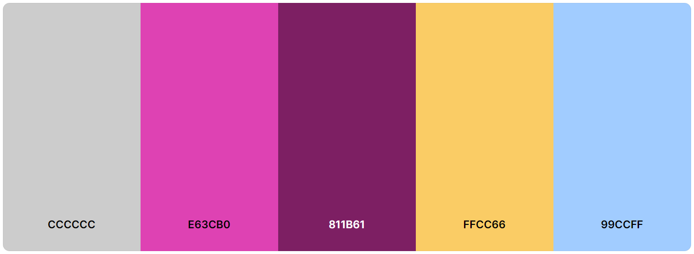

#### Typography
- Primary font: **Bad Script**, imported from Google Fonts, for a personal, handwritten feel.
   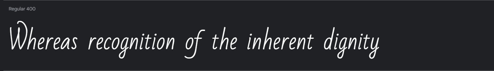

- Secondary font: **Happy Monkey**, sans-serif, for clear and readable content headers and navigation.
   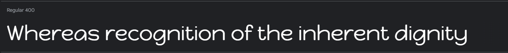

### `Imagery`

The use of carefully chosen imagery on "On a +ve Note" is integral to providing an engaging and inspirational experience that encourages positivity and personal growth. The selection and integration of visual elements are designed to complement the platform's user interface and overall design, creating an inviting atmosphere that supports our mission of positivity.

- **Background Images**: The platform features serene and uplifting background images that set a calming and motivational tone. These images might include landscapes, sunrise scenes, or abstract designs that inspire contemplation and optimism. The goal is to visually communicate the essence of self-improvement and mental well-being, making users feel supported and uplifted as they engage with the affirmations.

- **Affirmation Imagery**: Each affirmation is accompanied by a thematic image that reflects its message, whether it's self-love, confidence, motivation, or success. These images are selected to enhance the impact of the affirmations, making them more memorable and powerful. By pairing words with relevant visual cues, "On a +ve Note" aims to deepen the user's engagement and facilitate a more profound connection with the content.

- **User Interface Elements**: Design elements and icons used throughout the platform are chosen for their clarity and positive association. Soft, rounded shapes and gentle animations contribute to a user-friendly experience, making the platform accessible and enjoyable for all users.

Through thoughtful imagery, "On a +ve Note" seeks to create a space that visually and emotionally resonates with users, supporting their journey towards a more positive and fulfilled life.

### `Wireframes`

To visualize the design and user experience of "On a +ve Note" before development began, wireframes were created for key pages. These wireframes served as blueprints, guiding the layout and functionality of the site. Below, you can expand the section to view wireframes for the landing page, sign-in page, user profile page, login page, and affirmation generation page.

  
Expand to view wireframes

- **Landing Page:** This is the first page users see, designed to welcome them and explain the purpose of "On a +ve Note."
  
  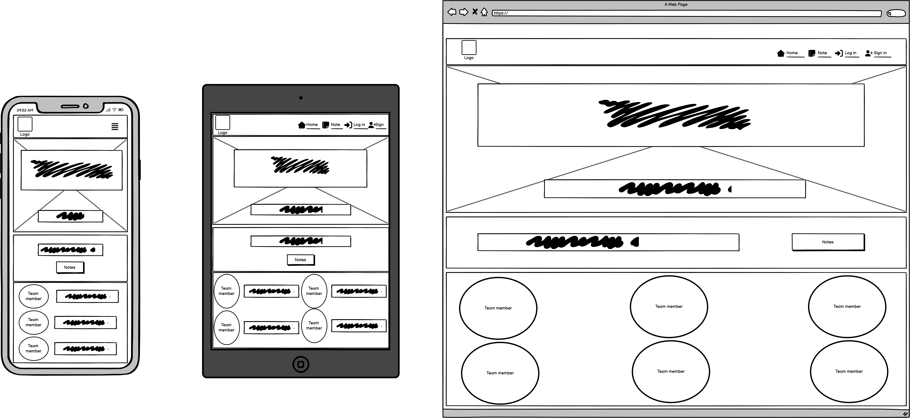

- **Sign In Page:** Allows users to create a new account to save and access their favorite affirmations.
  
  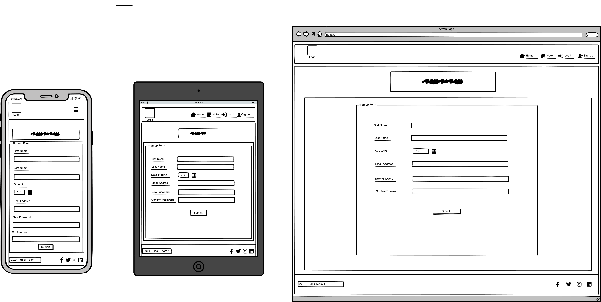

- **User Profile Page:** Here, users can view and edit their profile information, including saved affirmations.
  
  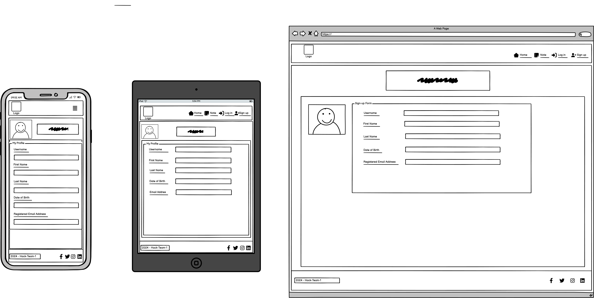

- **Login Page:** Existing users can log in to access their personalized affirmation collection.
  
  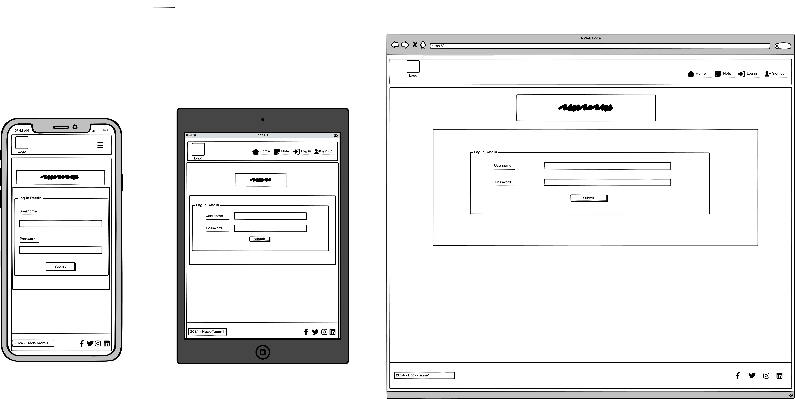

- **Affirmation Generation Page:** The core feature where users can discover and interact with new affirmations.
  
  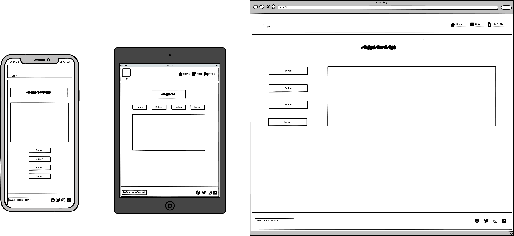

 
## Features

"On a +ve Note" is designed with simplicity and user engagement at its core. Each feature contributes to a seamless and positive user experience, encouraging daily interaction with affirmations. Here are the key features of the platform:

### `Header`
- **Navigation Bar**: Allows users easy access to the main sections of the website, including the home page, about section, and contact form. It's designed for intuitive navigation throughout the site.
- **Brand Logo**: Situated in the header for easy recognition, the logo acts as a home link, allowing users to return to the landing page at any time.

### `Main`
- **Dynamic Content Area**: This is the heart of "On a +ve Note," where users can explore a variety of affirmations. New affirmations are displayed each day, and users can browse through categories such as self-love, motivation, and success.
- **Favorite System**: Users can mark affirmations as favorites, saving them to their profile for easy access. This personalized collection serves as a tool for daily inspiration and reflection.
- **Sharing Functionality**: With social sharing options, users can spread positivity by sharing their favorite affirmations on social media platforms, fostering a community of encouragement and support.

### `Footer`
- **Links**: Provides additional navigation options to users, including a link to the FAQ section and terms of service.
- **Social Media Icons**: Encourages users to follow "On a +ve Note" on various social media platforms to stay updated on new features and daily affirmations. These icons are direct links that make it easy for users to connect with the community outside the website.

Each feature of "On a +ve Note" is carefully crafted to support our mission of promoting positivity and personal growth. By engaging with the platform, users can make affirmations a part of their daily routine, contributing to a healthier mindset and a more optimistic outlook on life.

## Future Features

Looking ahead, "On a +ve Note" aims to continuously evolve and introduce new features that enhance user engagement and promote a positive community. Here are some of the planned future features:

### `Custom Affirmation Creation`
- **Personalized Affirmations**: Allow users to create and save their own affirmations, offering a more personalized experience. This feature will enable users to tailor affirmations to their specific goals and needs.

### `Community Forums`
- **Discussion Platforms**: Implement forums where users can discuss their experiences, share stories of personal growth, and offer support to each other. This will foster a sense of community and provide a space for collective encouragement.

### `Affirmation Reminders`
- **Scheduled Notifications**: Users can set up daily or weekly affirmation reminders via email or push notifications, ensuring they never miss their daily dose of positivity.

### `Integration with Calendars and Productivity Apps`
- **App Integration**: Seamlessly integrate "On a +ve Note" with popular calendar and productivity applications. This feature will allow users to include affirmations in their daily schedules, making positivity a part of their routine.

### `User-Curated Collections`
- **Shared Affirmation Collections**: Users can curate collections of affirmations based on themes or personal preferences and share these with the community. This collaborative feature will enrich the variety of affirmations available to all users.

### `Advanced Profile Customization`
- **Enhanced User Profiles**: Introduce more options for users to customize their profiles, including selecting themes, setting goals, and tracking progress on personal growth journeys.

### `Analytics Dashboard`
- **Insightful Analytics**: Provide users with insights into their interaction patterns with affirmations, such as most viewed categories, frequency of use, and progress tracking. This data can help users understand their preferences and growth over time.

## Technologies Used

### `Backend`
- **Django**: A high-level Python web framework that encourages rapid development and clean, pragmatic design. It was chosen for its robustness, scalability, and ease of integration with databases. Django's built-in admin panel greatly simplified the process of managing user accounts and affirmations.

- **PostgreSQL**: Served as the primary database to store user data, affirmation texts, and categories. It was selected for its reliability, integrity, and compatibility with Django.

- **Gunicorn**: A Python WSGI HTTP Server for UNIX, used as the interface between our web application and Heroku's web server. It enabled efficient deployment of the Django application on Heroku.

### `Frontend`
- **HTML5**: Provided the structure for the web application, defining elements such as forms for signing up/logging in, affirmation display sections, and navigation menus.

- **CSS3**: Added styling to the HTML structure, used for creating visually appealing layouts, color schemes, and responsive designs.

- **JavaScript (ES6+)**: Introduced interactivity to the web pages, handling events like clicks for favoriting affirmations, toggling between affirmation categories, and dynamic content loading.

### `Deployment and Version Control`
- **Heroku**: A cloud platform service that enables the deployment of web applications over the Internet. It was used to deploy "On a +ve Note," making it accessible to users.

- **Git**: Employed for version control, facilitating the tracking of changes, collaboration, and maintaining a history of the project's development process.

- **GitHub**: Hosted the project's repository, providing a platform for code management, issue tracking, and collaboration among developers.

### `Development Tools and Libraries`
- **GitPod**: Used as the Integrated Development Environment (IDE), offering a pre-configured workspace with all necessary dependencies for developing, running, and debugging the project.

- **Bootstrap**: Leveraged for its responsive design templates and components, enhancing the user interface with minimal custom CSS.

- **Font Awesome**: Provided icons used throughout the application for a cleaner, more intuitive user interface.

- **Google Fonts**: Offered a selection of web fonts, allowing for the customization of typography to fit the aesthetic of the application.

- **Whitenoise**: Integrated with Django to serve static files seamlessly in production on Heroku, improving the efficiency of content delivery.

### `Additional Technologies`
- **Django Allauth**: Utilized for authentication, registration, and account management, streamlining the process of user sign-ups, logins, and social account integration.

- **Django REST Framework**: Implemented to create a RESTful API for the application, enabling seamless data exchange between the frontend and backend and facilitating future development of mobile applications or third-party integrations.

This comprehensive set of technologies, frameworks, and tools facilitated the creation of "On a +ve Note" as a dynamic, secure, and user-friendly platform dedicated to fostering positivity through daily affirmations.

## Testing

Testing was conducted to ensure functionality, responsiveness, and compatibility across a wide range of devices and browsers. Additionally, code validation and performance testing were performed to guarantee the quality and efficiency of the application.

### `Manual Testing`

Manual tests were carried out to verify the application's features and user interactions. Key areas of focus included:

- Account registration and login process
- Functionality of saving and retrieving favorite affirmations
- Responsiveness and interactivity of the user interface
- Sharing affirmations on social media platforms

**Device and Browser Compatibility**: 
The application was tested on multiple devices (smartphones, tablets, and desktops) and browsers (Chrome, Firefox, Safari, and Edge) to ensure consistent behavior and appearance.

**Responsive Design**: 
The application's responsiveness was verified using Chrome Developer Tools' device simulation feature, ensuring a seamless user experience across various screen sizes.

### `Code Validations`

To maintain code quality and ensure adherence to web standards, the following validations were performed:

**HTML Validation**:
- Tool: [W3C Markup Validation Service](https://validator.w3.org/)
- Result: No errors found.

**CSS Validation**:
- Tool: [W3C CSS Validation Service](https://jigsaw.w3.org/css-validator/)
- Result: No errors found.

**JavaScript Validation**:
- Tool: [JSHint](https://jshint.com/)
- Result: No errors found.

### `Performance Testing`

Google Lighthouse was utilized to assess the application's performance, accessibility, best practices, and SEO. The tests were conducted on both mobile and desktop versions to optimize user experience and search engine visibility.

**Google Lighthouse Results**:
- Performance
- Accessibility
- Best Practices
- SEO

| Home Page | Affirmation Page | Contact us Page |
| ---- | ---- | ---- |
| 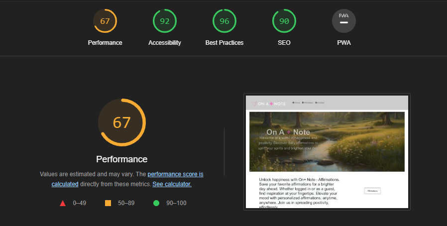 | 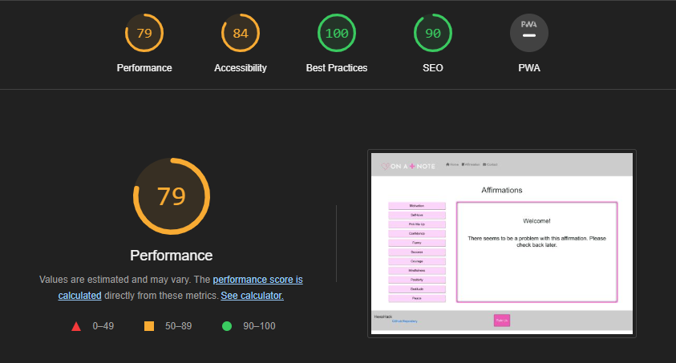 | 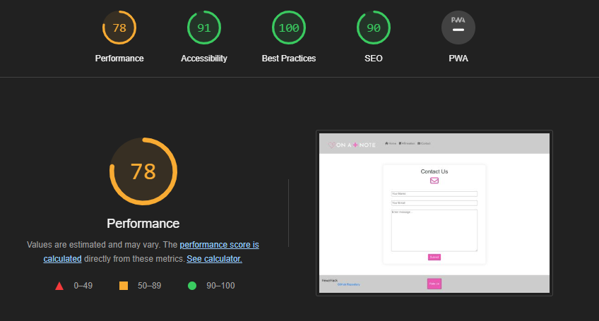|

## Bugs

### `Solved Bugs`

1. **Affirmation Save Feature Bug**
   - **Description**: Users were unable to save their favorite affirmations due to a missing database connection.
   - **Solution**: Established the correct database link and ensured user authentication before saving affirmations.

2. **Responsive Design Issue**
   - **Description**: The affirmation cards were not displaying correctly on mobile devices.
   - **Solution**: Adjusted CSS media queries and flexbox settings to ensure proper display across all screen sizes.

3. **Social Sharing Functionality**
   - **Description**: The share button did not trigger the expected social media platforms.
   - **Solution**: Integrated a third-party social sharing library and updated API keys for each platform.

### `Unfixed Bugs`

The favorite affirmation function does not work, the link is still left on the notes.html page as we want to work on it later. 

## Deployment

The website is currently deployed on Heroku. You can access the live site here: [On a +ve Note Live Site](https://positive-note-ec9b8f1f6fb7.herokuapp.com/).

### `Deploying on Heroku`

1. **Prepare the Application**:
   - Ensure your application is ready for deployment, including finalizing the feature set and conducting thorough testing.

2. **Create a `Procfile`**:
   - Heroku requires a `Procfile` to know how to run your application. For a Django project, your `Procfile` should contain: `web: gunicorn your_project_name.wsgi`.

3. **Set Up Heroku CLI**:
   - Install the Heroku CLI on your local machine and log in using `heroku login`.

4. **Create a Heroku App**:
   - Run `heroku create your-app-name` to create a new app on Heroku. Replace `your-app-name` with the desired name for your application.

5. **Set Environment Variables**:
   - Use `heroku config:set VAR_NAME=value` to set up necessary environment variables, such as `DJANGO_SECRET_KEY`, `DEBUG_VALUE`, and any other API keys your project requires.

6. **Deploy**:
   - Push your code to Heroku using `git push heroku master`.

7. **Run Migrations**:
   - Execute `heroku run python manage.py migrate` to apply database migrations.

8. **Create a Superuser** (optional):
   - If your application requires an admin user, create one with `heroku run python manage.py createsuperuser` and follow the prompts.

9. **Visit Your App**:
   - Open your app in a browser using `heroku open` or navigate to the app's URL directly.

### `Local Development`

To set up this project locally, follow these steps:

1. **Clone the Repository**:
   - Use `git clone https://github.com/your-username/your-repository.git` to clone the project repository to your local machine.

2. **Set Up a Virtual Environment**:
   - Run `python -m venv env` to create a virtual environment.
   - Activate the environment with `source env/bin/activate` on Unix/Linux or `env\Scripts\activate` on Windows.

3. **Install Dependencies**:
   - Install project dependencies by running `pip install -r requirements.txt`.

4. **Set Environment Variables**:
   - Create a `.env` file in the root directory of the project. Add necessary variables like `DJANGO_SECRET_KEY` and `DEBUG_VALUE`.

5. **Migrate the Database**:
   - Apply migrations with `python manage.py migrate`.

6. **Run the Development Server**:
   - Start the development server with `python manage.py runserver`.

7. **Access the Site**:
   - Open your web browser and navigate to `http://127.0.0.1:8000/` to view the site.

Remember to replace `your-username` and `your-repository` with your actual GitHub username and repository name for the project.

## Credits

Baby

### `Content and Resources`

- **Affirmation Content**: The affirmations provided on the platform were inspired by various sources, including [Positive Psychology](https://positivepsychology.com/positive-affirmations/) and [Mindful](https://www.mindful.org/). Each affirmation has been carefully selected and rewritten to align with the site's goals.
- **Images and Icons**: The imagery used across the site, including background images and icons, were sourced from [Unsplash](https://unsplash.com/) and [Font Awesome](https://fontawesome.com/), respectively. Special thanks to the talented photographers and designers who make their work available for use.
- **Code Snippets and Libraries**:
  - Django: The project utilizes the [Django](https://www.djangoproject.com/) framework for web development. Official Django documentation was instrumental in the development process.
  - Heroku Deployment: Guidance on deploying Django apps to Heroku was found on [Heroku's Official Documentation](https://devcenter.heroku.com/articles/getting-started-with-python).
- **404 Page** 404 page [CodePen](https://codepen.io/Navedkhan012/pen/vrWQMY).
- **500 Page** 500 page [CodePen](https://codepen.io/grantjenkins/pen/KKoemZO).
- **Account Pages** [Styling django-allauth Authentication Pages](https://builtwithdjango.com/blog/styling-authentication-pages).
- **Favicon** [Ebay](https://www.ebay.de/itm/394776621113?chn=ps&_ul=DE&_trkparms=ispr%3D1&amdata=enc%3A1XsUnb_P1RRKUKf0RxEv9Hw87&norover=1&mkevt=1&mkrid=707-168914-907737-8&mkcid=2&itemid=394776621113&targetid=293946777986&device=c&mktype=pla&googleloc=1000927&poi=&campaignid=20354691798&mkgroupid=151907125395&rlsatarget=pla-293946777986&abcId=&merchantid=678252821&gad_source=1&gclid=CjwKCAjwnv-vBhBdEiwABCYQA7WSLd2PycWVqT635BwjkGZZ-pREpZkF8H81_QJxylCvVhTdkdQbhhoCesQQAvD_BwE).

*****************

[Back to top](#table-of-content)
